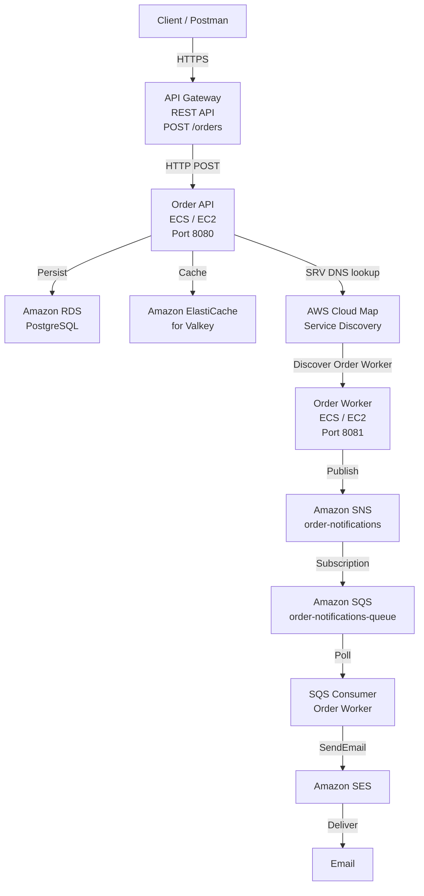

# Terraform MSP — Event-Driven Microservices on AWS

An event-driven microservices application built with **Java Spring Boot, Docker, Terraform, and AWS**.

The project demonstrates containerized microservices running on **Amazon ECS with EC2 capacity**, synchronous service-to-service communication through **AWS Cloud Map**, persistent storage using **Amazon RDS PostgreSQL**, caching using **Amazon ElastiCache for Valkey**, and asynchronous notification processing using **Amazon SNS, SQS, and SES**.

---

## Architecture



---

## Communication Model

The project uses two separate communication patterns.

### Synchronous Communication

The Order API communicates with the Order Worker through **AWS Cloud Map Service Discovery**.

```text
Order API
    |
    v
AWS Cloud Map
    |
    v
Order Worker
```

### Asynchronous Notification Processing

The notification pipeline uses **SNS → SQS → SES**.

```text
Order Worker
    |
    v
SNS
    |
    v
SQS
    |
    v
SQS Consumer
    |
    v
SES
    |
    v
Email
```

**SQS is not used between Order API and Order Worker.**

---

# Request Flow

When a client creates an order:

```text
POST /orders
      |
      v
API Gateway
      |
      v
Order API
      |
      +-----------------> RDS PostgreSQL
      |                       |
      |                       +-- Order stored
      |
      +-----------------> Valkey
      |                       |
      |                       +-- Order cached
      |
      v
AWS Cloud Map
      |
      v
Order Worker
      |
      v
SNS Topic
      |
      v
SQS Queue
      |
      v
SQS Consumer
      |
      v
SES
      |
      v
Email
```

---

# Order API

The Order API is a Spring Boot REST microservice responsible for receiving and creating orders.

## Endpoint

```http
POST /orders
```

## Example Request

```json
{
  "customer": "Akash",
  "product": "Laptop",
  "quantity": 1
}
```

## Responsibilities

- Accept order requests
- Persist orders in PostgreSQL RDS
- Cache orders in Valkey
- Discover the Order Worker using AWS Cloud Map
- Send the order to the Order Worker over HTTP

---

# Order Worker

The Order Worker is a Spring Boot service running on ECS.

## Responsibilities

- Receive orders from the Order API
- Process the order
- Publish an order notification to SNS
- Poll the SQS notification queue
- Extract the actual `Message` field from the SNS notification envelope
- Send an order confirmation email through SES
- Delete the SQS message only after successful email delivery

---

# Data Storage

## Amazon RDS PostgreSQL

RDS PostgreSQL provides persistent relational storage for orders.

Example query:

```sql
SELECT * FROM orders ORDER BY id DESC;
```

The Order API writes each newly created order to PostgreSQL.

---

## Amazon ElastiCache for Valkey

Valkey is used as the caching layer.

Example cache key:

```text
order:5
```

Example cached value:

```text
customer=Akash,product=Laptop,quantity=1
```

The application stores the order in PostgreSQL and then caches a representation in Valkey.

---

# Service Discovery

AWS Cloud Map provides private DNS-based service discovery between the microservices.

## Namespace

```text
terraform-msp.local
```

## Services

```text
order-api.terraform-msp.local
order-worker.terraform-msp.local
```

The Order API dynamically discovers the Order Worker through an SRV DNS record instead of using a hard-coded worker IP address.

Example:

```bash
dig SRV order-worker.terraform-msp.local
```

The resulting SRV record provides the worker host and port.

This allows the Order API to dynamically discover the Order Worker.

---

# Event-Driven Notification Pipeline

After processing an order, the Order Worker publishes a notification to SNS.

```text
Order Worker
     |
     v
SNS Topic
     |
     v
SQS Queue
     |
     v
SQS Consumer
     |
     v
SES
     |
     v
Email
```

## SNS

Topic:

```text
order-notifications
```

The Order Worker publishes the processed order notification to this topic.

## SQS

Queue:

```text
order-notifications-queue
```

The SQS queue is subscribed to the SNS topic.

The Order Worker contains a background consumer that continuously polls the queue.

## SES

The SQS consumer sends the processed order information through Amazon SES.

The SQS message is deleted only after SES successfully sends the email.

---

# SNS Message Processing

SNS delivers a notification envelope to SQS.

The consumer extracts only the actual `Message` field.

Example SNS message:

```json
{
  "Type": "Notification",
  "MessageId": "example-id",
  "TopicArn": "arn:aws:sns:...",
  "Message": "Order processed for customer: Akash, Product: Laptop, Quantity: 1",
  "Timestamp": "2026-08-31T10:24:39.889Z"
}
```

The consumer extracts:

```text
Order processed for customer: Akash, Product: Laptop, Quantity: 1
```

The SNS metadata such as:

- Type
- TopicArn
- Timestamp
- Signature
- SigningCertURL
- UnsubscribeURL

is not included in the final email.

---

# Email

The final order confirmation email contains only the relevant order information.

Example:

```text
Your order has been successfully processed.

Order Details:

Order processed for customer: Akash, Product: Laptop, Quantity: 1

Thank you for shopping with us!

Regards,
Order Processing Team
```

---

# AWS Infrastructure

Infrastructure is provisioned using **Terraform**.

Major infrastructure components include:

```text
Terraform
|
+-- VPC
|   +-- Public Subnet
|   +-- Private Subnet
|   +-- Route Tables
|   +-- Internet Gateway
|
+-- ECS
|   +-- ECS Cluster
|   +-- Capacity Provider
|   +-- EC2 Auto Scaling Group
|   +-- Order API Service
|   +-- Order Worker Service
|
+-- ECR
|   +-- order-api
|   +-- order-worker
|
+-- RDS PostgreSQL
|
+-- ElastiCache for Valkey
|
+-- AWS Cloud Map
|   +-- order-api
|   +-- order-worker
|
+-- SNS
|
+-- SQS
|
+-- SES
|
+-- API Gateway
|
+-- CloudWatch
|
+-- IAM
```

---

# Terraform

Terraform is used to provision and manage the AWS infrastructure as code.

Typical workflow:

```bash
terraform init
terraform validate
terraform plan
terraform apply
```

To destroy the environment:

```bash
terraform destroy
```

Terraform makes it possible to reproduce or remove the infrastructure without manually configuring every AWS service.

---

# Docker

Both microservices are containerized using Docker.

## Images

```text
order-api
order-worker
```

Example:

```bash
docker build -t order-api:v10 .
docker build -t order-worker:v5 .
```

The resulting images are pushed to Amazon ECR and referenced by ECS task definitions.

---

# Amazon ECR

Container images are stored in ECR repositories:

```text
527165097816.dkr.ecr.ap-south-1.amazonaws.com/order-api
527165097816.dkr.ecr.ap-south-1.amazonaws.com/order-worker
```

Images are versioned using tags.

Example:

```text
order-api:v10
order-worker:v5
```

---

# Amazon ECS

The application runs using **ECS with EC2 capacity**.

## ECS Cluster

```text
terraform-msp-cluster
```

## ECS Services

```text
order-api
order-worker
```

## Container Ports

```text
Order API     : 8080
Order Worker  : 8081
```

The Order API is exposed through the EC2 host.

The Order Worker is used internally and is discovered using AWS Cloud Map.

---

# API Gateway

Amazon API Gateway provides the public API entry point.

The request flow is:

```text
Client
   |
   v
API Gateway
   |
   v
EC2 Public IP :8080
   |
   v
Order API
```

## Public Endpoint

```http
POST /prod/orders
```

Example:

```text
https://<api-id>.execute-api.ap-south-1.amazonaws.com/prod/orders
```

## Example Request

```json
{
  "customer": "Akash",
  "product": "Laptop",
  "quantity": 1
}
```

API Gateway forwards the request to the Order API running on ECS/EC2.

---

# IAM

IAM roles and policies provide the ECS workloads with access to required AWS services.

## Order Worker Permissions

### SNS

```text
sns:Publish
```

### SQS

```text
sqs:ReceiveMessage
sqs:DeleteMessage
sqs:GetQueueAttributes
```

### SES

```text
ses:SendEmail
ses:SendRawEmail
```

AWS credentials are supplied through the ECS task role instead of being hard-coded into the application.

---

# CloudWatch

Application and ECS logs are sent to Amazon CloudWatch.

Useful events include:

```text
Order received
Order saved to RDS
Order cached in Valkey
Order Worker discovered through Cloud Map
Order processed by worker
Notification published to SNS
Message received from SQS
Order details extracted from SNS
Email sent through SES
SQS message deleted
```

CloudWatch provides centralized logging for troubleshooting application and infrastructure issues.

---

# Testing

The project was tested layer by layer and end-to-end.

## 1. Test API Gateway

Send:

```http
POST /prod/orders
```

with:

```json
{
  "customer": "Akash",
  "product": "Laptop",
  "quantity": 1
}
```

Expected response:

```text
Order created with ID: <id> | Order processed for customer: Akash, Product: Laptop, Quantity: 1
```

---

## 2. Verify RDS

```sql
SELECT * FROM orders ORDER BY id DESC;
```

The newly created order should appear in PostgreSQL.

---

## 3. Verify Valkey

Example:

```bash
GET order:<id>
```

Expected value:

```text
customer=Akash,product=Laptop,quantity=1
```

---

## 4. Verify Cloud Map

```bash
dig SRV order-worker.terraform-msp.local
```

The SRV record should return the currently registered worker instance and port.

---

## 5. Verify Order Worker

CloudWatch logs should show that the Order Worker received the request from the Order API.

---

## 6. Verify SNS

Worker logs should show:

```text
Order notification published to SNS
```

---

## 7. Verify SQS

The SNS notification should arrive in:

```text
order-notifications-queue
```

Example:

```bash
aws sqs receive-message \
  --queue-url <QUEUE_URL> \
  --region ap-south-1
```

---

## 8. Verify SQS Consumer

Worker logs should show:

```text
Received message from SQS
```

and:

```text
Order details extracted from SNS:
```

---

## 9. Verify SES

The worker should send the extracted order information through SES.

Expected log:

```text
Order confirmation email sent successfully through SES
```

---

## 10. Verify Email

The recipient inbox should receive the final order confirmation email.

---

# End-to-End Architecture

The final architecture is:

```text
                         INTERNET
                            |
                            v
                    +---------------+
                    |  API Gateway  |
                    | POST /orders  |
                    +-------+-------+
                            |
                            | HTTP
                            v
                    +---------------+
                    |   Order API   |
                    |   ECS / EC2   |
                    |     :8080     |
                    +---+-------+---+
                        |       |
            +-----------+       +-----------+
            |                           |
            v                           v
    +---------------+          +---------------+
    | RDS PostgreSQL|          |    Valkey     |
    |   Persistent  |          |     Cache     |
    |     Data      |          |               |
    +---------------+          +---------------+
                        |
                        | Service Discovery
                        v
                    +---------------+
                    |   AWS Cloud   |
                    |      Map      |
                    +-------+-------+
                            |
                            v
                    +---------------+
                    | Order Worker  |
                    |   ECS / EC2   |
                    |     :8081     |
                    +-------+-------+
                            |
                            | Publish
                            v
                    +---------------+
                    |      SNS      |
                    | order-        |
                    | notifications |
                    +-------+-------+
                            |
                            | Subscription
                            v
                    +---------------+
                    |      SQS      |
                    | order-        |
                    | notifications |
                    +-------+-------+
                            |
                            | Poll
                            v
                    +---------------+
                    | SQS Consumer  |
                    | Order Worker  |
                    +-------+-------+
                            |
                            | SendEmail
                            v
                    +---------------+
                    |      SES      |
                    +-------+-------+
                            |
                            v
                          EMAIL
```

---

# Project Structure

```text
Terraform-msp/
|
+-- order-api/
|   |
|   +-- src/
|   +-- Dockerfile
|   +-- pom.xml
|   +-- mvnw
|   +-- mvnw.cmd
|   +-- README.md
|
+-- order-worker/
|   |
|   +-- src/
|   +-- Dockerfile
|   +-- pom.xml
|   +-- mvnw
|   +-- mvnw.cmd
|   +-- README.md
|
+-- Terraform/
    |
    +-- api_gateway.tf
    +-- cloudwatch.tf
    +-- ecr.tf
    +-- ecs.tf
    +-- ecs_capacity.tf
    +-- ecs_services.tf
    +-- iam.tf
    +-- network.tf
    +-- service_discovery.tf
    +-- messaging.tf
    +-- rds.tf
    +-- valkey.tf
    +-- security_groups.tf
    +-- variables.tf
    +-- outputs.tf
    +-- providers.tf
```

---

# Technologies

| Technology | Purpose |
|---|---|
| Java 21 | Application runtime |
| Spring Boot | Microservices framework |
| Spring Web | REST API |
| Spring Data JPA | PostgreSQL integration |
| Spring Data Redis | Valkey integration |
| PostgreSQL | Persistent order storage |
| Valkey | Caching |
| Docker | Containerization |
| Terraform | Infrastructure as Code |
| Amazon ECS | Container orchestration |
| Amazon EC2 | ECS compute capacity |
| Amazon ECR | Container image registry |
| AWS Cloud Map | Service discovery |
| Amazon RDS | Managed PostgreSQL |
| Amazon ElastiCache | Managed Valkey |
| Amazon SNS | Event publishing |
| Amazon SQS | Message queue |
| Amazon SES | Email delivery |
| Amazon API Gateway | Public API entry point |
| Amazon CloudWatch | Logging and monitoring |
| AWS IAM | Access control |
| Amazon VPC | Network infrastructure |

---

# Key Design Decisions

## 1. Cloud Map for Microservice Communication

The Order API does not hard-code the Order Worker IP address.

Instead:

```text
Order API
    |
    v
AWS Cloud Map
    |
    v
Order Worker
```

This allows the worker to be dynamically discovered.

---

## 2. SNS → SQS for Asynchronous Notifications

The notification workflow is decoupled from the synchronous order request.

```text
Order Worker
    |
    v
SNS
    |
    v
SQS
    |
    v
SQS Consumer
    |
    v
SES
```

---

## 3. SQS Message Deletion After Successful Processing

The consumer follows this order:

```text
Receive message
      |
      v
Extract SNS Message
      |
      v
Send email through SES
      |
      v
Successful?
   /       \
 YES       NO
  |         |
  v         v
Delete    Keep message
message   for retry
```

This prevents a failed email delivery from immediately losing the notification.

---

## 4. Persistent Storage and Caching

PostgreSQL is used for persistent storage while Valkey is used for fast cached access.

```text
Order API
   |
   +----> RDS PostgreSQL
   |
   +----> Valkey
```

---

## 5. API Gateway as the Public Front Door

API Gateway provides the public interface while the microservices remain behind the API layer.

```text
Internet
    |
    v
API Gateway
    |
    v
Order API
```

The Order API and Order Worker continue using Cloud Map for internal service discovery.

---

# Troubleshooting

## Order API Returns HTTP 500

Check the Order API logs:

```bash
aws logs tail /ecs/order-api \
  --since 10m \
  --region ap-south-1
```

Check:

- Order Worker status
- Cloud Map registration
- Worker port
- ECS task status
- Security group rules

---

## Order Worker Is Not Reachable

Check the ECS service:

```bash
aws ecs describe-services \
  --cluster terraform-msp-cluster \
  --services order-worker \
  --region ap-south-1
```

Check the EC2 host:

```bash
docker ps
```

Check port 8081:

```bash
nc -zv 10.0.1.9 8081
```

---

## SNS Message Is Not Reaching SQS

Check the SNS subscription:

```bash
aws sns list-subscriptions-by-topic \
  --topic-arn <TOPIC_ARN> \
  --region ap-south-1
```

Check the queue:

```bash
aws sqs get-queue-attributes \
  --queue-url <QUEUE_URL> \
  --attribute-names All \
  --region ap-south-1
```

---

## Email Is Not Being Sent

Check the Order Worker CloudWatch logs.

Look for:

```text
Received message from SQS
Order details extracted from SNS
```

followed by:

```text
Order confirmation email sent successfully through SES
```

Also verify that the SES sender and recipient identities are configured correctly.

---

# Cleanup

The entire infrastructure can be removed using:

```bash
terraform destroy
```

If ECR repositories contain images, configure:

```hcl
force_delete = true
```

or remove the images before deleting the repositories.

Always review the Terraform destroy plan before confirming destruction.

---

# Skills Demonstrated

This project demonstrates practical experience with:

- AWS infrastructure design
- Infrastructure as Code with Terraform
- Docker containerization
- Amazon ECS on EC2
- Amazon ECR
- Spring Boot microservices
- REST APIs
- API Gateway
- AWS Cloud Map service discovery
- PostgreSQL and Amazon RDS
- Valkey caching
- Event-driven architecture
- SNS → SQS messaging
- SQS polling
- SES email delivery
- IAM permissions
- CloudWatch logging
- AWS networking
- ECS service deployment
- Distributed application troubleshooting

---

# Author

**Akash Suresh**

AWS / DevOps / Cloud Computing Project
